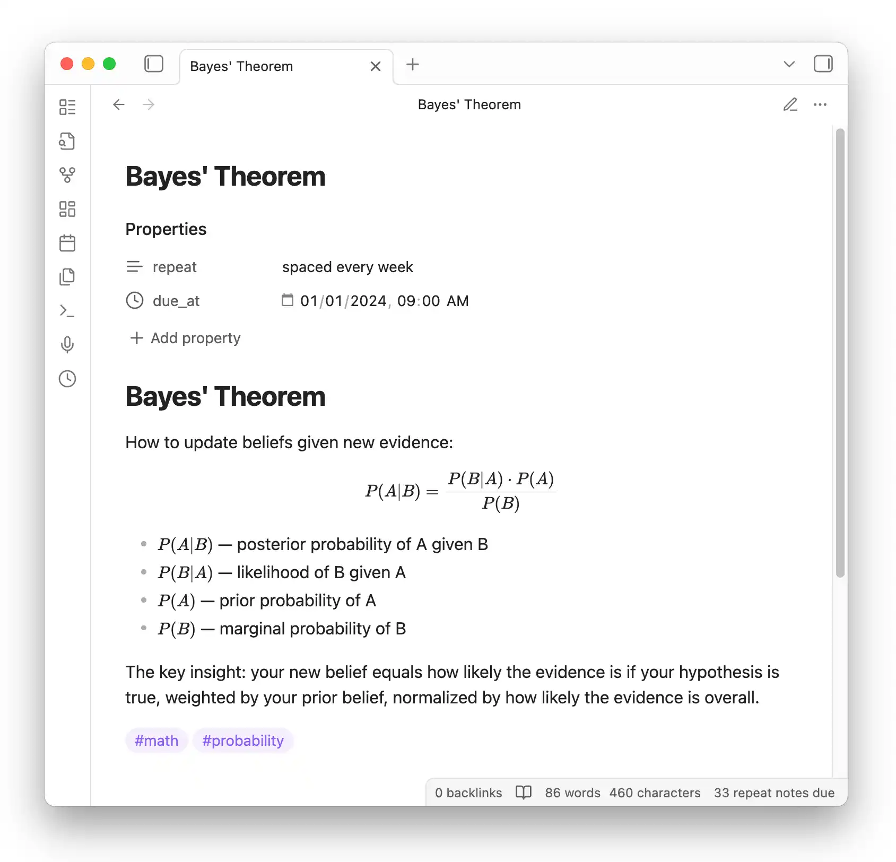
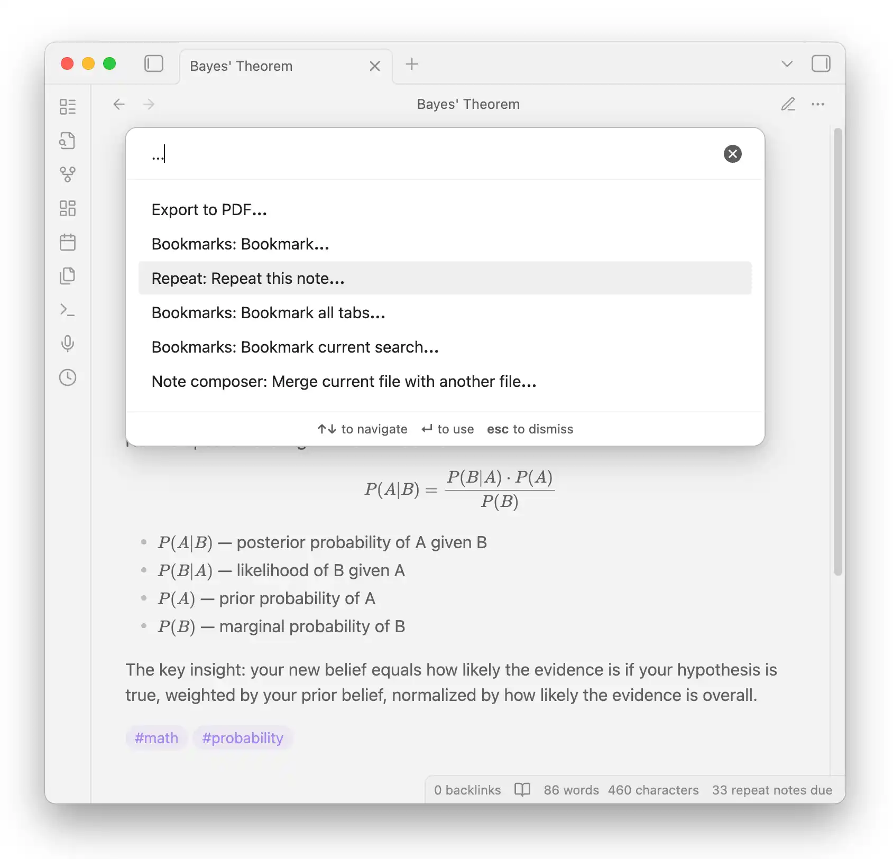
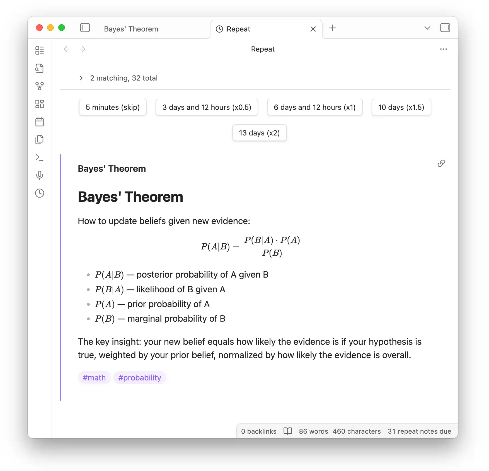
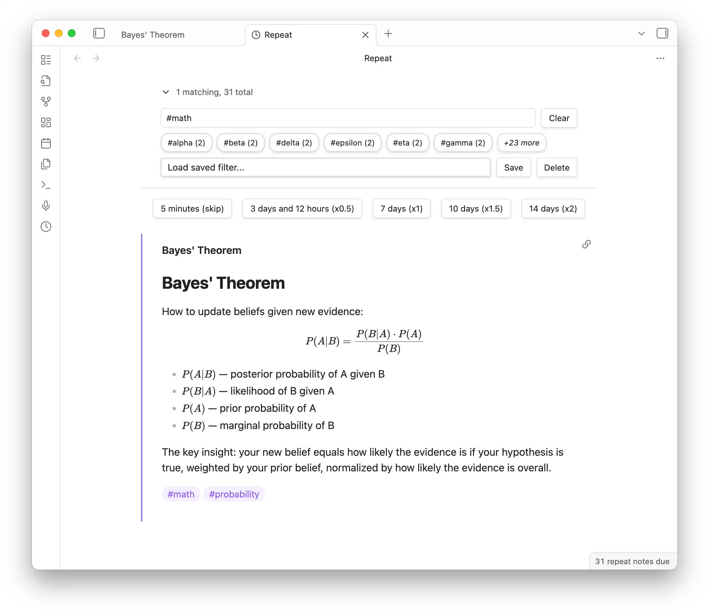

# Obsidian Repeat Plugin

Review notes using spaced repetition from right within Obsidian.

Mark any note for repetition with the `repeat` property. Notes become due according to their schedule and appear in a dedicated Repeat view. All repetition state is stored in the note's frontmatter, making it easy to understand and edit.

## Quick Start

1. Install [Dataview](https://github.com/blacksmithgu/obsidian-dataview) and Repeat Plugin from Community Plugins
2. Add a `repeat` property to any note (e.g., `repeat: every week`)
3. Open the Repeat view via the clock icon or `Repeat: Review due notes` command

## Marking Notes for Repetition

Add a `repeat` property to any note. You can also use the **`Repeat: Repeat this note...`** command:

### Periodic Repetition

Notes become due after a fixed interval:

- `daily`, `weekly`, `monthly`, `yearly`
- `every day`, `every week`, `every month`, `every year`
- `every 3 days`, `every 2 weeks`, etc.
- `every monday`, `every tue, thu`, `every sat and sun`

### Spaced Repetition

Add `spaced` to choose when to review next during each review:

- `spaced daily`, `spaced weekly`, `spaced monthly`
- `spaced every 3 days`, `spaced every 2 weeks`, etc.

### Other Options

- **Hidden content**: Add `hidden: true` to obscure the note body during reviews (click to reveal)
- **Evening reviews**: Add `in the evening` to the repeat value (e.g., `every day in the evening`)
- **Disable repetition**: Use `repeat: never` (or `off`, `no`, `false`)

## Reviewing Notes

Open the Repeat view to see due notes. Click a button to schedule the next review:

### Filtering

Click the note count to expand filter options. Filter by tags or any Dataview source expression:

- Click tag shortcuts to filter (e.g., `#math`)
- Use expressions like `#math OR #physics`
- Save frequently-used filters for quick access

## How Scheduling Works

- **Periodic**: Due dates stay evenly spaced. If you miss reviews, the note catches up to the next occurrence.
- **Spaced**: You pick a multiplier (x0.5, x1, x1.5, x2) to adjust the interval each review.
- **Skip**: The `5 minutes (skip)` button bumps the due time without changing the schedule.
- The `due_at` property is calculated automatically after each review.

## Installation

Install from **Settings > Community plugins > Browse**:

1. Dataview Plugin (required)
2. Repeat Plugin

## Resources

- [GitHub Issues](https://github.com/prncc/obsidian-repeat-plugin) — Report bugs or request features
- [obsidian-scripts](https://github.com/prncc/obsidian-scripts) — Bulk add `repeat` to existing notes
- Development: `yarn install && yarn dev`
